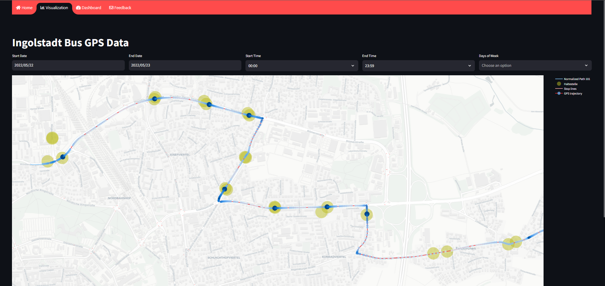

# VGI Dashboard



> [!NOTE]  
> Check dependencies before running - ```pip install -r requirements.txt```

### Scope
1. Create a dashboard to show visual representation of bus path based on their waiting time.
2. Add multiple features to categorize them on different scenarios (eg: "route 101, from april to june 2023, on all wednesdays")

### To run
- Dashboard : ```streamlit run my_app.py```

### Info
- Source code for the dataset, pre-processing and other used methods are not fully shared, as this is currently part of the research group.
